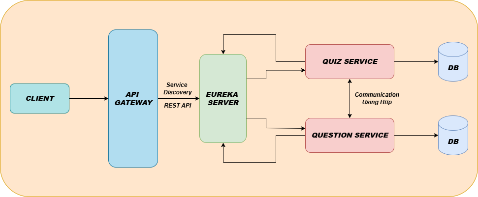

# 🧠 Quiz Application - Microservices Architecture

This is a microservices-based Quiz Application built using Spring Boot. It allows users to take quizzes based on questions served by distributed services. The architecture is designed for scalability, maintainability, and ease of service discovery using Eureka.

---

## 🚀 Tech Stack

- **Java + Spring Boot**
- **Spring Cloud Netflix Eureka** – Service Discovery
- **Spring Cloud Gateway** – API Gateway
- **RESTful APIs**
- **Maven**
- **Postman / Browser** – For testing

---

## 📦 Microservices in the Application

| Service Name     | Description |
|------------------|-------------|
| **Quiz Service**     | Handles quiz creation, assignment, and access to questions. |
| **Question Service** | Provides question data to the quiz service. |
| **API Gateway**      | Acts as a single entry point to route requests to services. |
| **Eureka Server**    | Service registry to enable dynamic discovery of services. |

---

## 🧭 Architecture Diagram

Below is the architecture of the system showing all microservices and how they interact with the API Gateway and Eureka server.

> All microservices register themselves with Eureka Server. The API Gateway uses Eureka for dynamic routing.

---

## 🔗 Service Flow

1. **Client (Browser/Postman)** sends a request to the **API Gateway**.
2. The **API Gateway** queries **Eureka Server** to locate the appropriate service.
3. Request is routed to **Quiz Service**.
4. **Quiz Service** internally communicates with the **Question Service** to fetch questions.
5. All services are registered with the **Eureka Server** for discovery and health monitoring.

---
